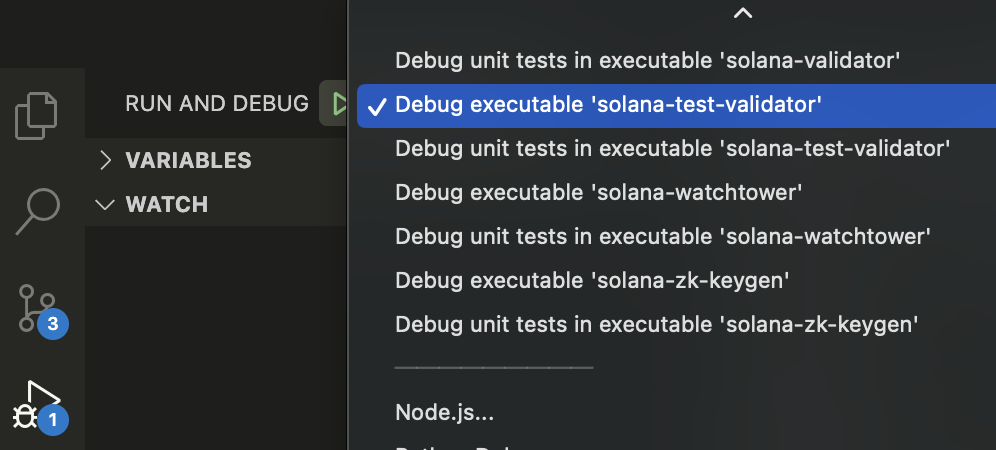
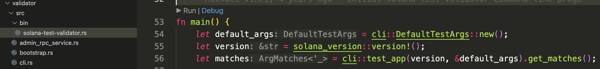
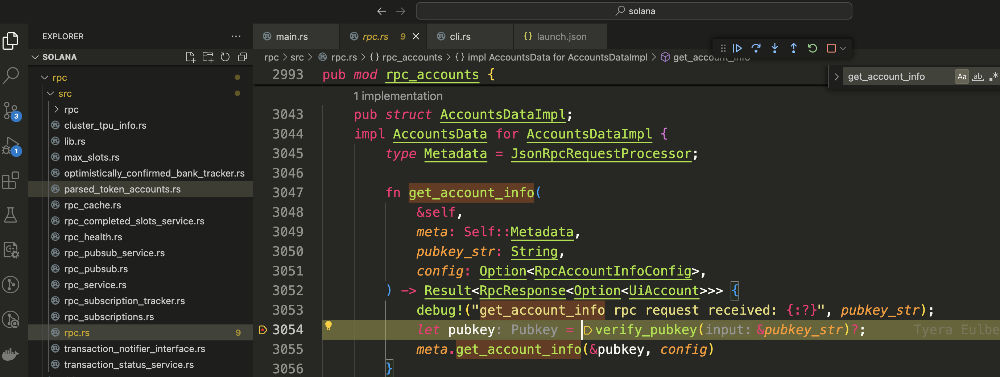

## Run/Debug Solana Code in Local
### setup
Run/Debug Solana code in local is very similar with run a Solana test Validator introduced by [official link](https://solana.com/developers/guides/getstarted/local-rust-hello-world#run-your-localhost-validator).

* download source code  
```git clone git@github.com:solana-labs/solana.git```  
the latest version of Solana is at https://github.com/anza-xyz/agave, but for learning perpose, we can use old version at `https://github.com/solana-labs/solana/commit/27eff8408b7223bb3c4ab70523f8a8dca3ca6645`
* install rust, protobuf, solana cli   

* run Solana test Validator. The code entrance is at

```validator/src/bin/solana-test-validator.rs```  


* setup config  
```solana config set --url localhost```
* do some tx like with your account
```
solana airdrop 2
``` 

### Debug in vscode
click debug button in vscode and generate launch.json file, choose `solana-test-validator`



run in debug mode and add breakpoints at RPC entrance
`https://github.com/solana-labs/solana/blob/master/rpc/src/rpc.rs
`


```
curl http://localhost:8899 -X POST -H "Content-Type: application/json" -d '
  {
    "jsonrpc": "2.0",
    "id": 1,
    "method": "getAccountInfo",
    "params": [
      "<YOUR_ACCOUNT>",
      {
        "encoding": "base58"
      }
    ]
  }
'
```

